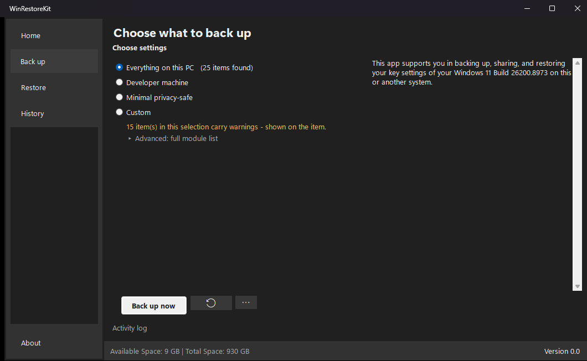
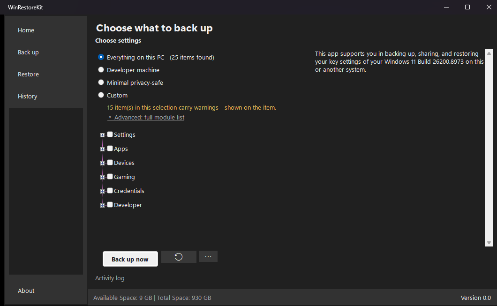

# WinRestoreKit

Back up, copy and restore Windows settings locally.

[](https://github.com/nicolasestrem/WinRestoreKit/releases/latest)
[](https://github.com/nicolasestrem/WinRestoreKit/releases)
[](LICENSE)
[](#requirements)

WinRestoreKit exports registry keys as `.reg` files and copies folders and files into a timestamped
backup folder. Backups stay offline and local, with no cloud account and no telemetry.



## Key features

- Back up and restore selected modules for Windows settings, apps, devices, Wi-Fi credentials, and
  developer tooling.
- Start from a preset, or open the full module list and pick individual items.
- Review a restore wizard that states what will be overwritten and what it cannot undo before you
  consent.
- Create an automatic pre-restore snapshot of the settings about to be overwritten.
- Browse backups and undo points in a History timeline.
- Store a machine-readable `backup_manifest.json` beside each backup log for backup metadata and
  status.



## What restore actually guarantees

Restore is deliberately blunt about its limits, because both of its mechanisms are additive:
`regedit /s` merges, and a folder copy leaves destination files that the source does not contain in
place. Before a restore runs, the app takes a pre-restore snapshot and tells you, verbatim:

> The snapshot can put back settings this restore overwrites. It cannot remove registry values or
> files that this restore adds — restoring the snapshot merges it over the current state rather than
> resetting to it.

The same sentence appears in the confirmation dialog, in the snapshot's `backup_log.txt` header and
in `restore_log.txt`, from a single constant, so the promise cannot be worded more strongly in one
place than another.

## Requirements

- Windows 11, 64-bit. Windows 10 should work, but is untested.
- Run as administrator. Registry export and import shell out to `regedit.exe`, which requires
  elevation.

No .NET installation is required. The runtime is bundled, which is why the download is around 69 MB
rather than about 1 MB. It is still a single `WinRestoreKit.exe` file.

## Download

Download [WinRestoreKit.exe](https://github.com/nicolasestrem/WinRestoreKit/releases/latest) from
the latest release.

The binary is not code-signed, so SmartScreen will warn on first run. Choose **More info**, then
**Run anyway**, or build it yourself from the steps below.

## Using existing Appcopier backups

WinRestoreKit uses the same backup format, and existing Appcopier backups remain compatible. To
reuse an existing backup collection, either place `WinRestoreKit.exe` beside the existing `app\`
directory, or copy the existing `app\` directory beside `WinRestoreKit.exe`.

Copy the backup collection before trying this. Do not experiment on the only copy of a backup
folder. Older backups can still show an `Appcopier` header line inside `backup_log.txt`; this is
expected and harmless.

## Building from source

Build and test the solution:

```powershell
dotnet build src\WinRestoreKit.sln
dotnet test src\WinRestoreKit.sln
```

Publish the self-contained single-file release artifact. This block uses `cmd` line continuations
(`^`) so that it stays byte-identical to the release checklist in
`.claude/skills/release/SKILL.md` and the two cannot drift; in PowerShell, put it on one line
instead.

```bat
dotnet publish src\WinRestoreKit\WinRestoreKit.csproj -c Release -r win-x64 --self-contained true ^
     -p:PublishSingleFile=true -p:IncludeNativeLibrariesForSelfExtract=true ^
     -p:EnableCompressionInSingleFile=true -p:DebugType=none -o publish
```

## Documentation

- [CHANGELOG.md](CHANGELOG.md) - release history, including the Appcopier era.
- [docs/ROADMAP.md](docs/ROADMAP.md) - what is planned next.
- [MIGRATION.md](MIGRATION.md) - what the rename from Appcopier changed, and what it did not.
- [NOTICE.md](NOTICE.md) - attribution.

## Project history and attribution

WinRestoreKit began as a fork of [Appcopier by Builtbybel](https://github.com/builtbybel/Appcopier).
It has since been substantially rebuilt with a new engine, restore-safety model, test suite and
interface. The original project and its copyright remain acknowledged under the MIT licence.

## Licence

WinRestoreKit is available under the MIT licence, retaining the original copyright alongside the new
one. See [LICENSE](LICENSE) and [NOTICE.md](NOTICE.md).
